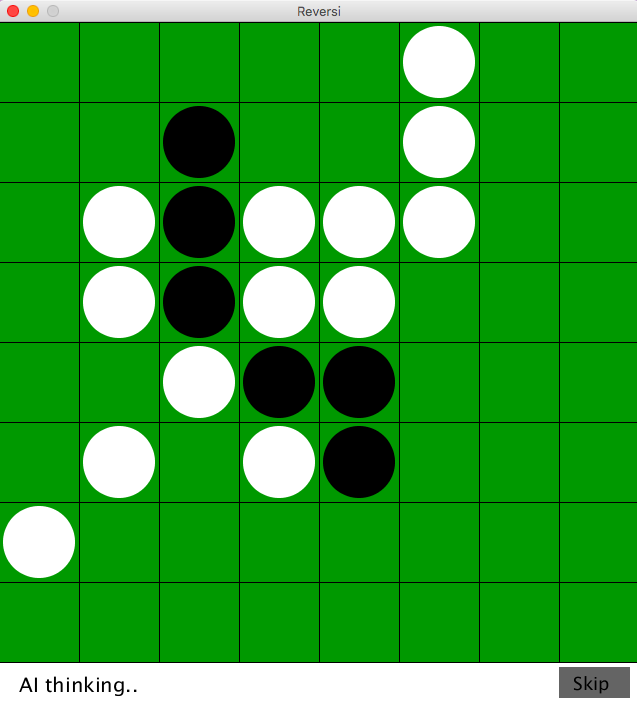
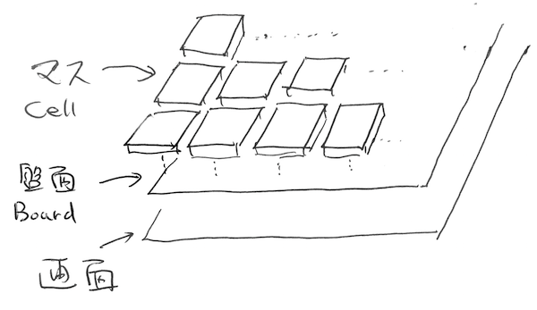
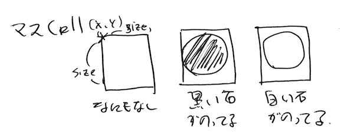

Processingによるオセロ(リバーシ)ゲーム
==========================

動いている様子: https://www.instagram.com/p/BXrRJpvFvwQ/

## 概要

ごく簡単なオセロ(リバーシ)ゲームです。
プログラミング学習用のサンプルになるのを想定してます。

現状の敵AIは愚直なものなので非常に弱いです。

## 起動方法

Processingをインストールしたのち `Reversi/Reversi.pde`をダブルクリックしてください

## 基本的な考え方

[Reversi/Reversi.pde](Reversi/Reversi.pde)がメインのロジックです

画面の上の盤面(Boardクラスのオブジェクト)が載っていて、盤面がマス(Cellクラスのオブジェクト)を8x8の行列の形をもっています。

それぞれのマスは３つの状態をもちます

### 石を置くとき

1. クリックした位置にあるマスを盤面から取り出す
2. そこに石を置いたらひっくりかえすマスがあるかどうか確認
3. ある場合は石を置く、なかったら何もしない

### ひっくり返すかどうか確認する

[Reversi/Board.pde](Reversi/Board.pde)  `ArrayList<Cell> cellsToFlipWith(Cell cell, int stone)`

1. 縦横斜めの８方向に並ぶマスをそれぞれ配列として取り出す
1. それぞれの配列のマスを一個一個確認し、自分と違う色がならんでいて、その先に自分と同じ色があるかを確認する
1. 上のパターンに当てはまる場合は、その途中の石をひっくりかえせるマスとして配列まとめて返す

### 敵AIのロジック

[Reversi/Ai.pde](Reversi/Ai.pde) `Cell think()`

もっとも愚直なロジックなのでちょう弱い

1. 石を置けるマスを確認する
2. 一番ひっくりかえせる石が多いマスに置く

#### 改良案

以下のように改良すれば強くなる

1. オセロの形勢の評価は単に自分のコマがどれだけ多いかであるからして、盤面のスコアを計算できるようにする
1. 自分の手の後に相手の動きを計算し、相手が最高の打ち手をすると仮定して、次に石を置いたときにもっともスコアが高くなるマスをピックアップする

